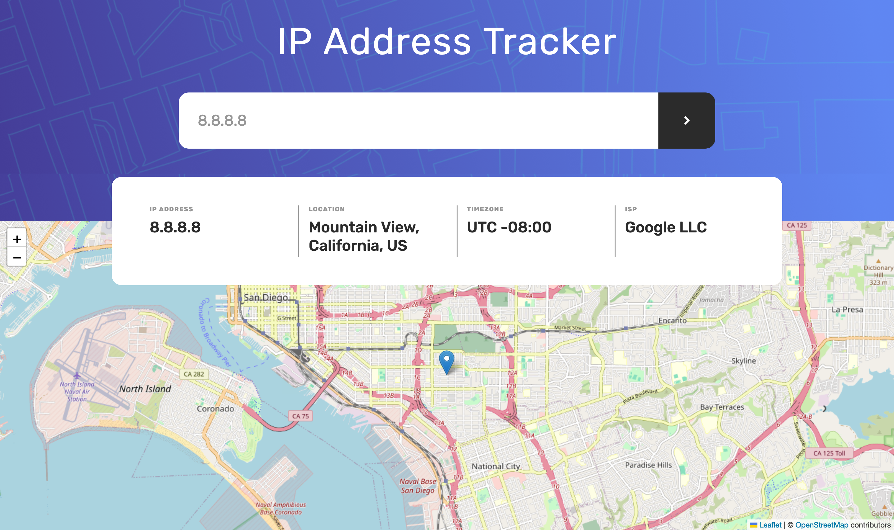
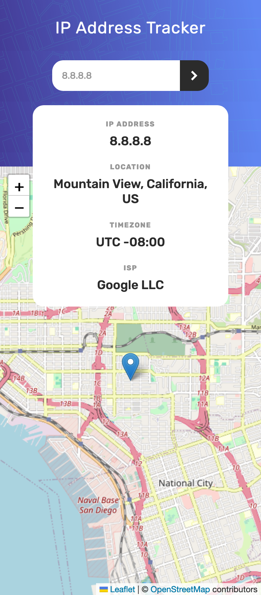

# Frontend Mentor - IP address tracker solution

This is a solution to the [IP address tracker challenge on Frontend Mentor](https://www.frontendmentor.io/challenges/ip-address-tracker-I8-0yYAH0). Frontend Mentor challenges help you improve your coding skills by building realistic projects. 

## Table of contents

- [Overview](#overview)
  - [The challenge](#the-challenge)
  - [Screenshot](#screenshot)
  - [Links](#links)
- [My process](#my-process)
  - [Built with](#built-with)
  - [What I learned](#what-i-learned)
  - [Continued development](#continued-development)
  - [Useful resources](#useful-resources)
- [Author](#author)

## Overview

IP Address checker that uses the IP Geolocation API by IPify and Leaflet maps. Created with help of React, HTLM and Sass/CSS.

### The challenge

Users should be able to:

- View the optimal layout for each page depending on their device's screen size
- See hover states for all interactive elements on the page
- See their own IP address on the map on the initial page load
- Search for any IP addresses or domains and see the key information and location

### Screenshot

### Links

- Solution URL: [Github page - code](https://github.com/MCDoodle1/ip-tracker)
- Live Site URL: [Github Pages Live Site](https://mcdoodle1.github.io/ip-tracker/)

## My process

I started writing the HTML to define the App structure. Then I defined what was needed in React to make a functioning App. I learned how to implement the Geo location API and how to link it to the maps. I wrote the react code. Then I implemented Sass and wrote the CSS. I made the App fluid and responsive with CSS/Sass code I used earlier in other projects. 

### Built with

- CSS custom properties
- CSS Grid
- Responsive design with fluid typography
- [BEM](https://en.bem.info/methodology/css/) - BEM Methodology
- [React](https://reactjs.org/) - JS library
- [Sass](https://sass-lang.com) - Sass documentation

### What I learned

I learned more about working with API's in React and how to link data from the API to maps in Leaflet. I also learned how to hide an API key. I also continued learning about structuring CSS with Sass.

### Continued development

In a next project I want to extend my knowledge of React, learn more about semantic HTML and assistive technology like screen readers. I want to extend my knowledgde of CSS and Sass.

### Useful resources

- [IP Geolocation API](https://geo.ipify.org) - Real-time IP geolocation API that lets you look up IP locations.
- [React Leaflet v4.x](https://react-leaflet.js.org) - An open-source React library for interactive maps
- [Stack Overflow](https://stackoverflow.com/) - A public platform for coding questions & answers
- [Chat GPT 3.5](https://chat.openai.com)

## Author

- Website - [Marco Clarijs](https://github.com/MCDoodle1)
- Frontend Mentor - [@MCDoodle1](https://www.frontendmentor.io/profile/MCDoodle1)